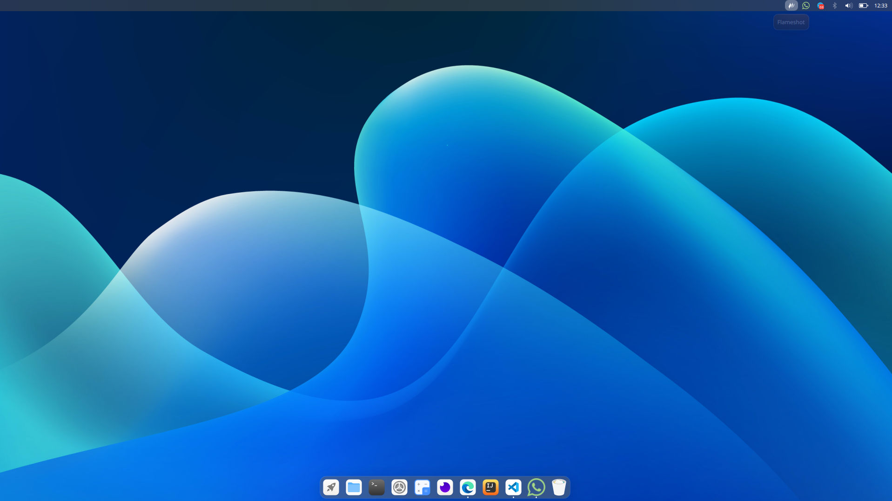
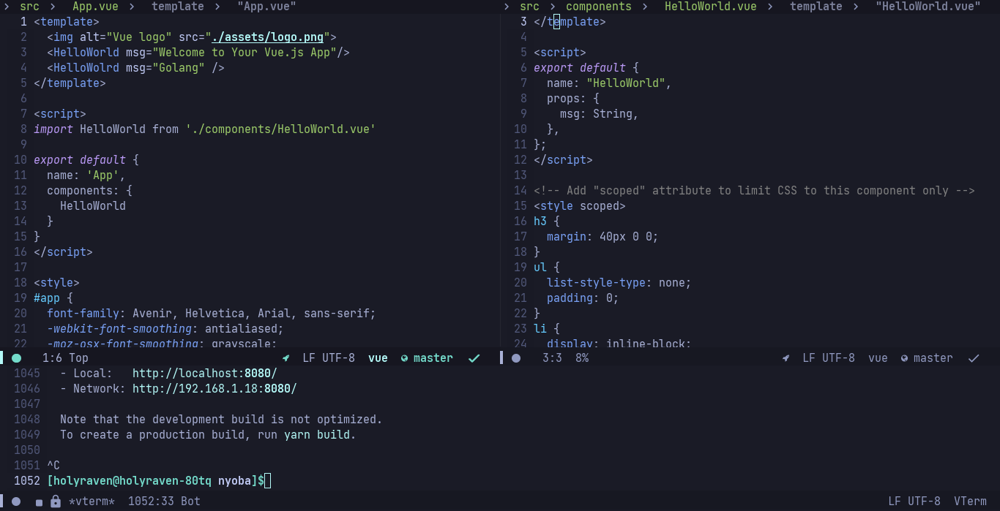
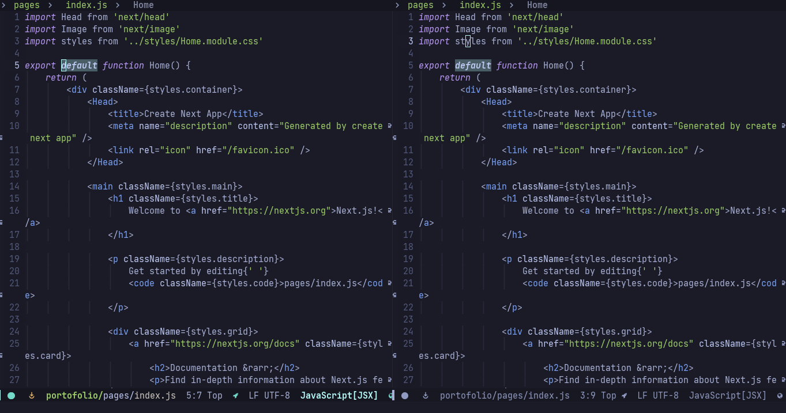
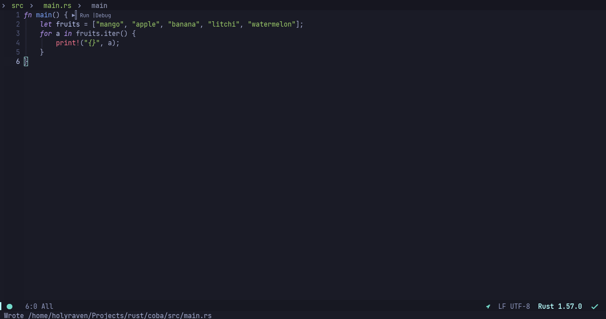

## Dotfile

Untuk biar ga repot install ulang

## Theme dan icon

theme https://github.com/TheGreatMcPain/gruvbox-material-gtk

## Config My Doom emacs

buat daily use flutter

## Introduction Emacs

Referensi https://tecosaur.github.io/emacs-config/config.html

## Cheatsheet Emacs

Referensi https://github.com/niyumard/Doom-Emacs-Cheat-Sheet

### Wallpaper and Preview

    
    

    
    

    
    

    
    

    
    

    

